# Veyron Architecture Diagrams
## Visual Reference for System Understanding

---

## 1. High-Level System Architecture

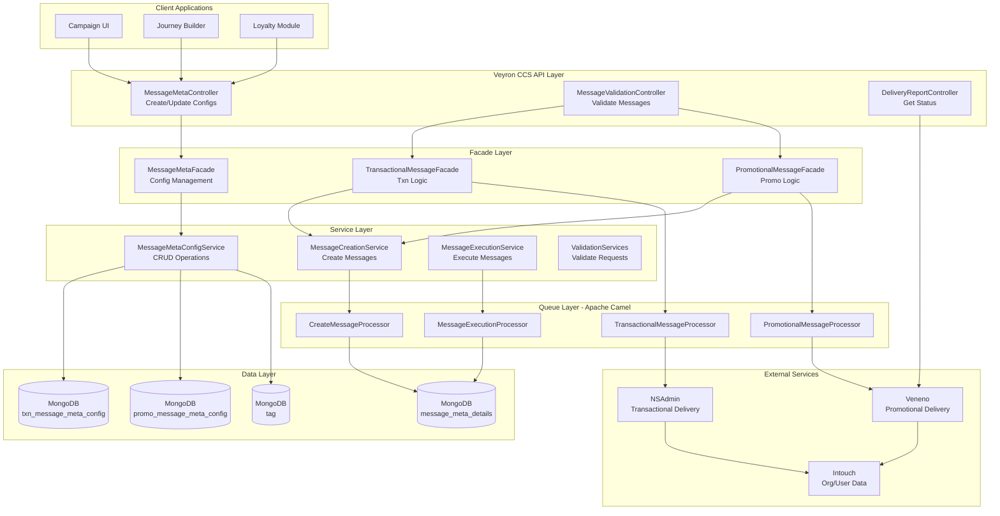

---

## 2. Message Flow - Transactional vs Promotional

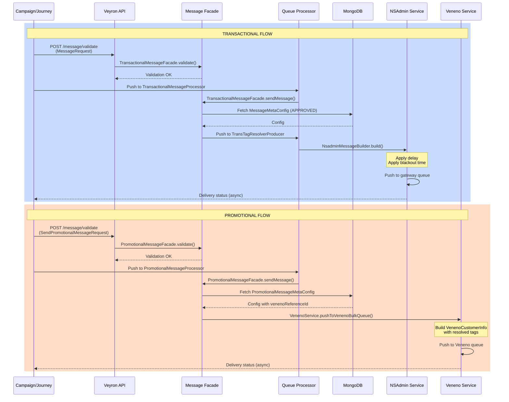

---

## 3. Data Model - MessageMetaConfig Hierarchy

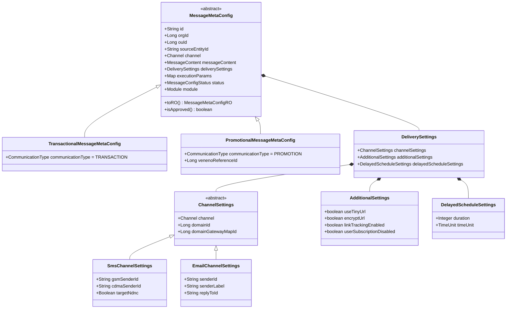

---

## 4. Queue Architecture

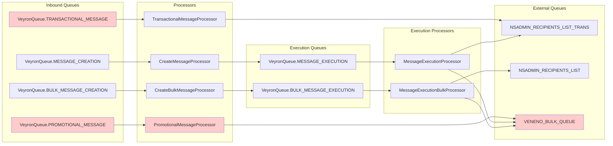

---

## 5. Validation Pipeline

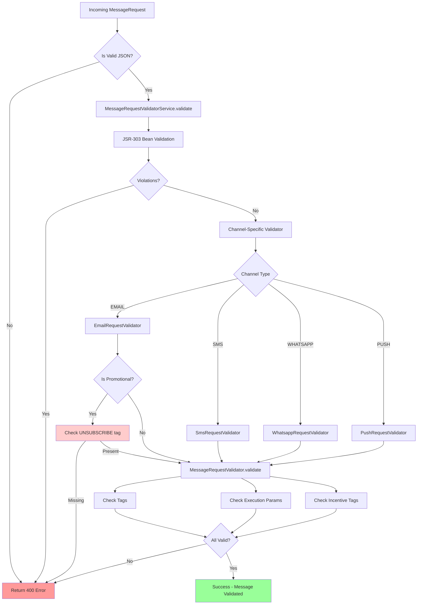

---

## 6. Tag System Architecture

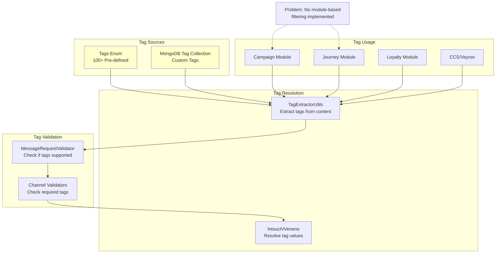

---

## 7. Delay & Scheduling Flow

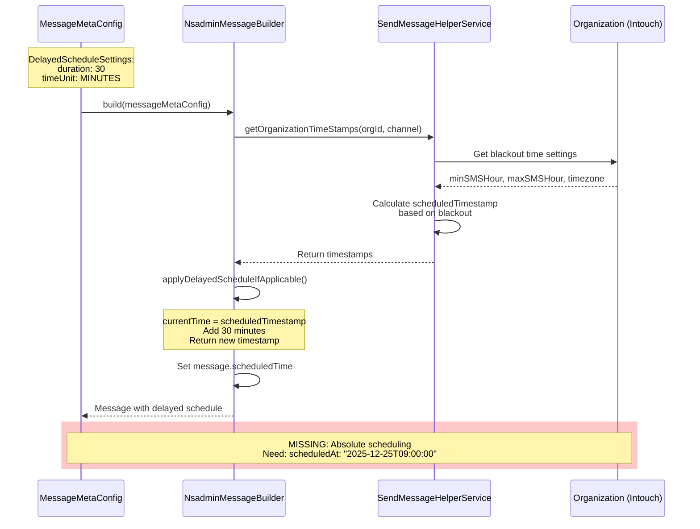

---

## 8. MongoDB Collections Structure

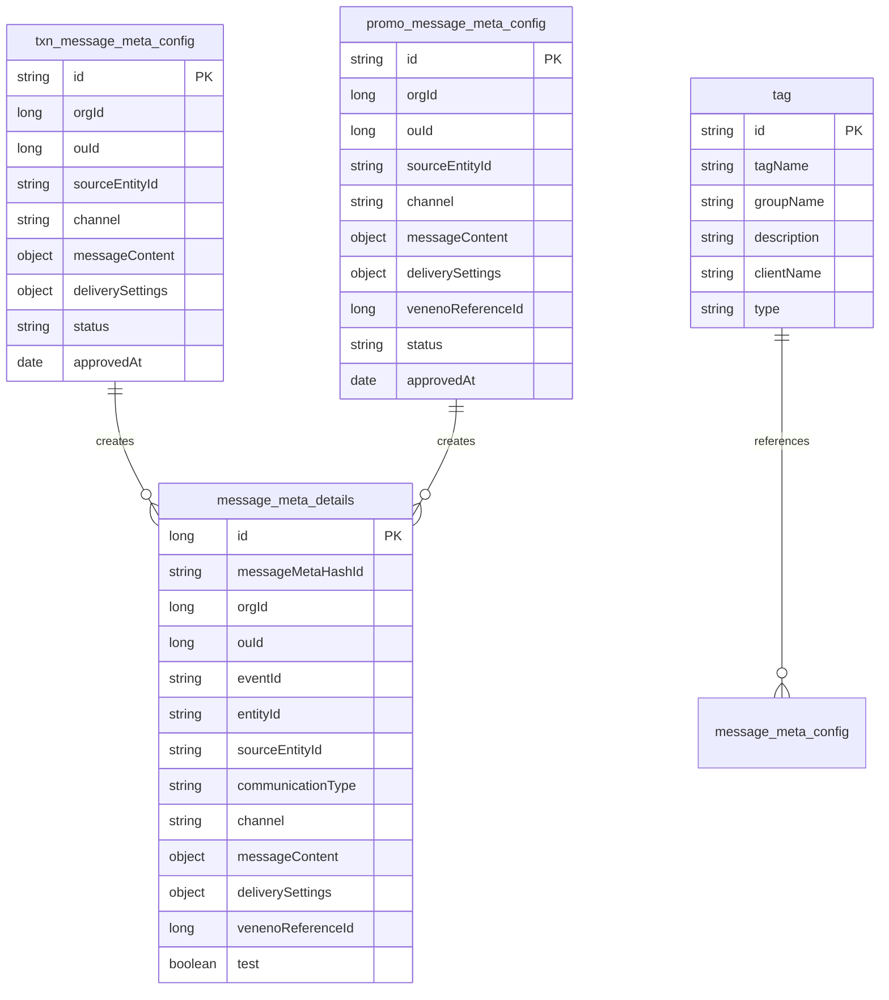

---

## 9. External Service Dependencies

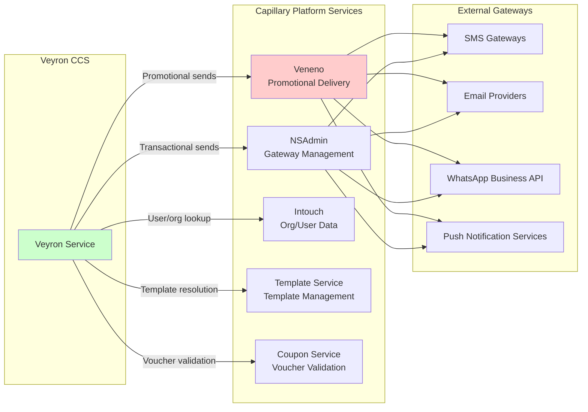

---

## 10. Feature Flags & Configuration

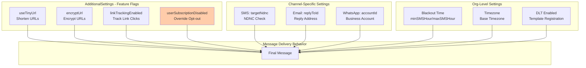

---

## 11. Implementation Roadmap - Gantt Chart

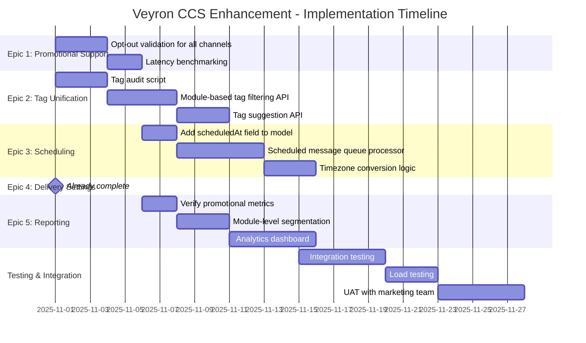

---

## 12. Monitoring & Observability

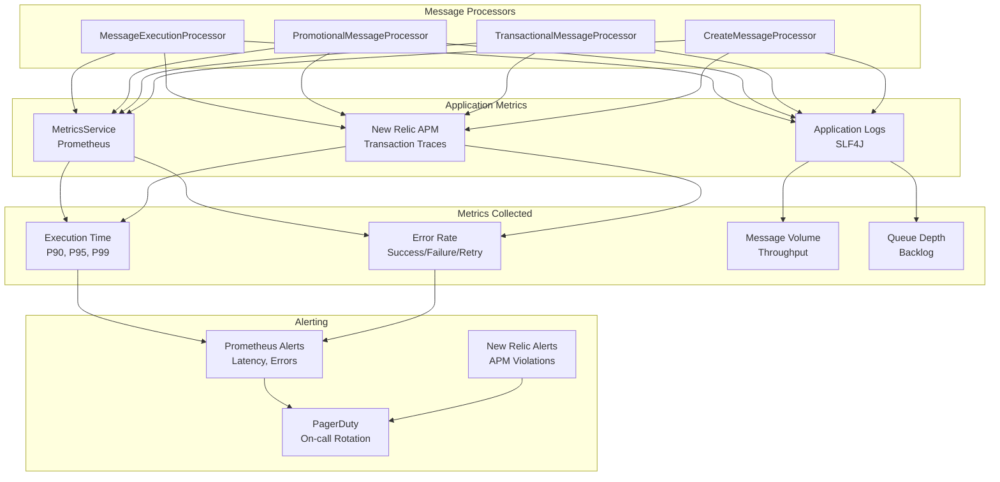

---

## How to Use These Diagrams

### Viewing in GitHub
All diagrams use **Mermaid syntax** and render automatically in GitHub README files. To view:
1. Open this file in GitHub web interface
2. Diagrams will render automatically
3. Or use [Mermaid Live Editor](https://mermaid.live) to edit

### Updating Diagrams
1. Edit the Mermaid code directly in this markdown file
2. Test changes in [Mermaid Live Editor](https://mermaid.live)
3. Commit changes to see them render in GitHub

### Exporting
- Use Mermaid Live Editor to export as PNG/SVG
- Use VS Code with Mermaid extension for local editing
- Use Confluence/Notion Mermaid plugins for documentation

---

**Document Version**: 1.0  
**Last Updated**: October 16, 2025  
**Maintained By**: Engineering Team

